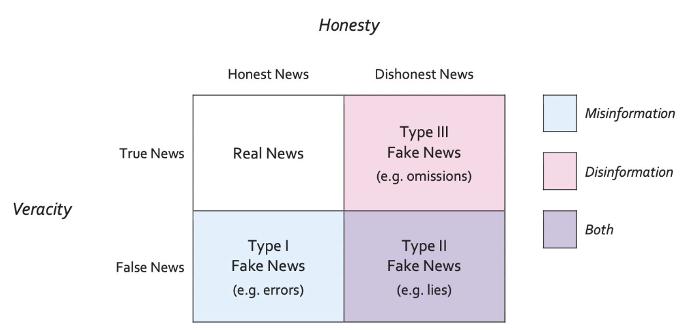

***

This report uses the [R programming language](https://cran.r-project.org/doc/FAQ/R-FAQ.html) [@R] and the following [R libraries](https://r-pkgs.org/intro.html) [@tidyverse;@knitr].

```{r, message=FALSE, warning=FALSE}
library(tidyverse)
library(knitr)
```

***

<!-- 
# Recap

So far we've talked about:

* Markdown for communication
* Data vs information
* Data types (from the programming and statistics sides)
* Data wrangling, i.e., data transformation
* Data visualization

These topics give us the skills to do various things with data, including:

* Importing
* Tidying
* Transforming
* Visualizing

These skills helps us undertake exploratory and descriptive analyses.

-->

# Data modeling

The next step is to **model data**. Scientists are interested in **discovering/understanding** something about real world phenomena. Three types of goals:

1. Describe
2. Explain
3. Predict

One goal of **data modeling** is to provide a summary of a data set, i.e., describe it. Another is to come up with **hypotheses for descriptive and inference purposes**.

@Nolan2011 define two main branches of modern statistics (not to be confused with the definitions by @Janert2010 below):

* **Descriptive statistics** organize, summarize, and communicate a group of numerical observations. 
  * Descriptive statistics describe large amounts of data in a single number or in just a few numbers.
  * A single number reporting e.g. the average is often far more useful and easier to grasp than a long list of the numbers.

* **Inferential statistics** use sample data to make general estimates about the larger population. 
  * Inferential statistics infer, or make an intelligent guess about, the whole population, i.e. also about the objects not included into the study.

One purpose of descriptive statistics is to efficiently summarize information for visual purposes.

On the other hand, **statistical inference** methods allow you to **draw a conclusion**, i.e., you infer something, about your data. This allows us to do things like fit statistical models and understand how they work and what they tell us about our data, so that we can test our hypotheses.


# Descriptive statistics

**Descriptive statistics** use [summary statistics](https://en.wikipedia.org/wiki/Summary_statistics) to **summarize a set of observations**, including for example:

* [Central tendency](https://en.wikipedia.org/wiki/Central_tendency)
* [Dispersion](https://en.wikipedia.org/wiki/Statistical_dispersion)
* [Shape of the distribution](https://en.wikipedia.org/wiki/List_of_probability_distributions)
* [Statistical dependence](https://en.wikipedia.org/wiki/Correlation)

The measure of [central tendency](https://en.wikipedia.org/wiki/Central_tendency) is one way to make many data points comprehensible to humans by compressing them into one value. Central tendency is a descriptive statistic that best represents the center of a data set i.e. a particular value that all the data seem to be gathering around it's the "typical" score.

The most commonly reported measure of central tendency is the **mean**, the arithmetic average of a group of scores.

The **median** is the middle score of all the scores in a sample when the scores are arranged in ascending order.

Simply creating a visual representation of the distribution often reveals its central tendency.

Let's look at some data about athletes.

```{r}
athletes <- read_csv('../4_data_wrangling/datasets/athletes.csv')
```

We can quickly visualize the distribution of our variables.

```{r}
hist(athletes$height)
```

```{r}
hist(athletes$weight)
```

```{r}
hist(athletes$age)
```

In a histogram or a polygon of a normal distribution the central tendency is usually near the highest point

The specific way that data cluster around a distribution's central tendency can be measured three different ways:

* [mean](https://en.wikipedia.org/wiki/Mean)
* [median](https://en.wikipedia.org/wiki/Median)
* [mode](https://en.wikipedia.org/wiki/Mode_(statistics))

Or visually:


Summary statistics only apply to unimodal distributions, i.e., distributions that have a single central peak. If this basic assumption is not met, the your conclusions may be wrong.

And recall the `summary` function that will give us a summary of descriptive statistics based on the data type in each column.

```{r}
summary(athletes)
```

# The big picture

## Overview

Here is the big picture.


Here's also a useful tutorial:

* http://varianceexplained.org/RData/

## A bit of history

A bit of history about statistics.

@Janert2010 asks, "what you really need to know about classical statistics, in the [excellent book](https://www.oreilly.com/library/view/data-analysis-with/9781449389802/), *Data analysis with open source tools*. Janert writes:

>>> BASIC CLASSICAL STATISTICS HAS ALWAYS BEEN SOMEWHAT OF A MYSTERY TO ME: A TOPIC FULL OF OBSCURE notions, such as t-tests and p-values, and confusing statements like "we fail to reject the null hypothesis"-—which I can read several times and still not know if it is saying yes, no, or maybe.* To top it all off, all this formidable machinery is then used to draw conclusions that don’t seem to be all that interesting—it’s usually something about whether the means of two data sets are the same or different. Why would I care?

>>> Eventually I figured it out, and I also figured out why the field seemed so obscure initially. In this chapter, I want to explain what classical statistics does, why it is the way it is, and what it is good for. This chapter does not attempt to teach you how to perform any of the typical statistical methods: this would require a separate book. (I will make some recommendations for further reading on this topic at the end of this chapter.) Instead, in this chapter I will tell you what all these other books omit.

>>> Let me take you on a trip. I hope you know where your towel is.

>>> *I am not alone—even professional statisticians have the same experience. See, for example, the preface of Bayesian Statistics. Peter M. Lee. Hodder & Arnold. 2004.

This chapter is totally worth reading! (So is the whole book.)

It describes, for example, **how did classical statistics come about?** 

In the late 19th and early 20th centuries by a small group of people, mostly in Great Britain, working for example at [Guinness](https://en.wikipedia.org/wiki/Guinness) and in agriculture. They had:

* No computational capabilities
* No graphing capabilities
* Very small and very expensive data sets

Their situation, as Janert notes, was basically the **opposite of what we have today**. Given their limitations, it took a great deal of ingenuity to solve problems that we -- for the most part -- no longer have, e.g.:

* We have lots of computing power
* We have lots of graphing capabilities
* There's lots of data out there

Instead, today's modern statistics is largely focused on areas like Bayesian reasoning, non-parametric tests, resampling, and simulations.

Nevertheless, statistics typically deals with drawing conclusions about a population by using a representative sample of that population.

* A **population** consists of all the scores of some specified group of interest (in texts one uses N to refer to it)
* A **sample** is a subset of a population (n)

Samples are used most often because we are rarely able to study every object in a population (e.g. every person in the world or in a country, every language, every sentence ever produced).

When properties of the population are inferred from a sample, we are undertaking **statistical inference**.


## Practice problems

**Population or sample?**

1. A principal of a large high school asked five teachers about the conditions in the teachers’ lounge.

* What is the sample?
* What is the population?

2. A poll taken in October 2004, which was funded by the European Union, found that 50.8% of the 8,075 married women surveyed in Turkey were married without their consent.

* What is the sample?
* What is the population?

3. Determine whether the data set is a population or a sample. Explain your reasoning.

* 1. The height of each player on a school’s basketball team
* 2. The amount of energy collected from every wind turbine on a wind farm 
* 3. A survey of 500 spectators from a stadium with 42,000 spectators
* 4. The annual salary of each pharmacist at a pharmacy
* 5. The cholesterol levels of 20 patients in a hospital with 100 patients
* 6. The number of televisions in each U.S. household
* 7. The final score of each golfer in a tournament
* 8. The age of every third person entering a clothing store
* 9. The political party of every U.S. president
* 10. The soil contamination levels at 10 locations near a landfill


# Hypothesis testing

## Procedure

[Hypothesis testing](https://en.wikipedia.org/wiki/Statistical_hypothesis_testing) is a way to interpret and draw conclusions about the [population](https://en.wikipedia.org/wiki/Statistical_population) of a [sample](https://en.wikipedia.org/wiki/Sample_(statistics)) of data.

* https://www.scribbr.com/statistics/hypothesis-testing/
* https://towardsdatascience.com/hypothesis-testing-in-real-life-47f42420b1f7
* http://www.biostathandbook.com/hypothesistesting.html

The logic of hypothesis testing is as follows. After we have identified the H0 and H1, we can do only one of two things:

1. Reject the H0 in favor of the H1 
2. Fail to reject H0 and thus keep it

Null hypothesis testing corresponds to a *reductio ad absurdum* argument in logic, i.e., a claim is assumed valid if its counter claim is improbable.

The procedure for deciding is roughly as follows:

1. Take a random sample from the population
2. Assume that H0 holds
3. If the sample data are consistent with the H0, keep H0
4. If the sample data are inconsistent with the H0, reject the H0 in favor of the H1.

Or another way of looking at it:

1. State your null hypothesis (H0) and alternative hypothesis (H1)
2. Choose your significance level (aka alpha)
3. Collect your data (e.g., take a sample the population)
4. Perform the appropriate statistical test and compute the p-value and compare it to the significance level
5. Decide whether to **reject** the null hypothesis (H0) or **fail to reject** it

Or another way of looking at it:

1. Choose a significance level (alpha)
2. Formulate a null hypothesis (H0)
3. Formulate an alternative hypothesis (H1)
4. Gather data, calculate a test statistic, e.g. T or F
5. Determine the probability (p-value) of obtaining T or F "or a more extreme value" under (H0)
6. If p ≤ alpha, reject H0

This procedure underlies most inferential statistics used in for example language sciences, e.g., t-tests, ANOVAs, linear regressions, mixed-effects regressions -- although the steps are not usually explicitly stated.

The procedure was originally developed by the English statistician Ronald Fisher in *The Design of Experiments* (1935). The book is considered a foundation work in experimental design, i.e., it introduced the concept of the null hypothesis.

**Contemporary science is based on the logic of falsification: it is impossible to prove that something is right, but it is possible to reject the opposite.**

In other words -- although H0 cannot be proven true, H0 can be proven false.

**A simple example**: 

>>> If someone claims that all swans are white, confirmatory evidence (in the form of lots of white swans) cannot prove the assertion to be true. However, contradictory evidence (in the form of a single black swan) makes it clear that the claim is invalid.

***

A note on statistical hypotheses. The null hypothesis (H0) is in essence a statement that there is **no relationship** between two variables, e.g.:

* There is no relationship between brain size and intelligence
* There is no relationship between the level of education and income
* There is no relationship between children’s self-esteem and that of their parent of the same sex
* There is no relationship between aging and memory loss
* There is no relationship between the amount of carrots eaten and ability to see in the dark
* There is no relationship between the number of consonants and number of vowels in the languages of the world

The alternative hypothesis (h1) simply states that there **is a relationship** between two variables. In its simplest forms H1 says only this:

* There is a relationship between the number of years of education people have and their income.
* There is a relationship between people’s gender and how much they talk about their emotional problems.
* There is a relationship between birth order and social dominance.
* There is a relationship between the number of speakers of a language and the size of phoneme inventory. 
* There is a relationship between the order of the verb and the object in a clause and the order of a head noun and an adjective in a NP.

***

Let's practice: H0 or H1?

1a. H___: There is no difference in the number of lexemes that denote snow in Eskimo and Yucatec Maya.

1b. H___: There are more lexemes that denote snow in Eskimo than in Yucatec Maya.

2a. H___: The more frequent a word, the faster it is recognized in a lexical decision task.

2b. H___: There is no relationship between the frequency of a word and how fast it is recognized in a lexical decision task.

3a. H___: There is a difference in the relative frequencies of metaphoric expressions used by men and women when they speak about sex.

3b. H___: There is no difference in the relative frequencies of metaphoric expressions used by men and women when they speak about sex.


***

## Directional vs. non-directional hypothesis

<!--
A hypothesis can be a statement about the value of a single population characteristic or the values of several population parameters.

The following are other examples of legitimate hypotheses:

* μ = 1000, where μ is the mean number of characters in an e-mail message
* p < .01, where p is the proportion of e-mail messages that are spam

In contrast, the statements x̄= 1000 and p̂ = .01 are not hypotheses, because x̄ (sample mean) and p̂ (sample proportion) are sample characteristics (i.e. statistics, not parameteters).

***
-->

A **non-directional** (two-tailed) H1 predicts that the independent variable will have an effect on the dependent variable, but the direction of the effect is not specified, e.g.:

* there will be **a difference** in how many numbers are correctly recalled by children and adults
* there is **no difference** between men and women with respect to weight/height

A **directional** hypothesis (one-tailed) predicts the nature of the effect of the independent variable on the dependent variable, e.g.:

* adults will correctly recall **more** words than children
* men are on average **heavier/taller** than women

***

Let's practice: Directional or non-directional?

1a. H0: There is no difference in the number of lexemes that denote snow in Eskimo and Yucatec Maya. 

1b. H1: There are more lexemes that denote snow in Eskimo than in Yucatec Maya.

2a. H0: There is no relationship between the frequency of a word and how fast it is recognized in a lexical decision task. 

2b. H1: The more frequent a word, the faster it is recognized in a lexical decision task.

3a. H0: There is no difference in the relative frequencies of metaphoric expressions used by men and women when they speak about sex. 

3b. H1: There is a difference in the relative frequencies of metaphoric expressions used by men and women when they speak about sex.


## Choosing the right statistic

**As data scientists, we may or may not be seasoned statisticians!**

One confusing aspect for scientists without a statistics background is: 

* **Which statistical test do I use?**

This question involves asking what are the relevant assumptions of the common statistical tests and when should I use which?

To answer which kind of statistical test you should ask:

* **What kind of distribution does my data follow?**

Different tests assume different distributions. In other words, how is your data shaped? Hint: visualize it!


A note about distributions:

* Parametric analyses are tests for which we have prior knowledge of the population distribution, e.g., we know the distribution is normal. They also include tests in which we can approximate a normal distribution with the [central limit therom](https://en.wikipedia.org/wiki/Central_limit_theorem).

* Non-parametric analyses are tests that do not make any assumptions about the parameters of the population under study, i.e., there is no known distribution. This is why they are also called distribution-free tests.

And like our [discussion on which plots to use](https://github.com/bambooforest/APY313/tree/main/6_data_visualization#which-plots-to-use) to visualize you data:

* **You also need to know what your data types are!**

How many variables do you have? 

Wow you going to test them, e.g., are you **comparing** two distributions?

As with the determining which [plot to use](https://github.com/bambooforest/IntroDataScience/tree/main/6_data_visualization#which-plots-to-use), note there are many resources out there to help you identify which statistical test to use!

* https://towardsdatascience.com/statistical-testing-understanding-how-to-select-the-best-test-for-your-data-52141c305168

* https://www.scribbr.com/statistics/statistical-tests/

* https://dacg.in/2018/11/17/statistical-test-cheat-sheet/


## Parametric tests

Parametric tests are the ones that can only used on data that confirm to the **three statistical assumptions** above.

1. **Regression tests**: used to test cause-and-effect relationships, e.g., if the change in one or more continuous variable predicts change in another variable.

* Simple linear regression: tests how a change in the predictor variable predicts the level of change in the outcome variable.

* Multiple linear regression: tests how changes in the combination of two or more predictor variables predict the level of change in the outcome variable

* Logistic regression: used to describe data and to explain the relationship between one dependent (binary) variable and one or more nominal, ordinal, interval or ratio-level independent variable(s).

2. **Comparison tests**: look for the difference between the means of variables, i.e., comparison of means.

* T-tests are used when comparing the means of precisely two groups, e.g., the average heights of men and women.

* Independent t-test: test for the difference between the same variable from different populations, e.g., comparing dogs to cats.

* ANOVA and MANOVA tests are used to compare the means of more than two groups or more, e.g., the average weights of children, teenagers, and adults.

3. **Correlation tests**: test for an association between variable checking whether two variables are related.

* Pearson Correlation: test for the strength of the association between two continuous variables.

* Spearman Correlation: tests for the strength of the association between two ordinal variables (note: it does not rely on the assumption of normally distributed data)

* Chi-Square Test: tests for the strength of the association between two categorical variables.

Understand your data and look at these flow charts, cheat sheets, etc., to figure out which test to use:

* https://dacg.in/2018/11/17/statistical-test-cheat-sheet/

* https://www.scribbr.com/statistics/statistical-tests/

* https://towardsdatascience.com/statistical-testing-understanding-how-to-select-the-best-test-for-your-data-52141c305168

## Parametric versus nonparametric statistics

Parametric analyses are tests for which we have prior knowledge of the population distribution, e.g., we know the distribution is normal. They also include tests in which we can approximate a normal distribution with the [central limit therom](https://en.wikipedia.org/wiki/Central_limit_theorem).

Non-parametric analyses are tests that do not make any assumptions about the parameters of the population under study, i.e., there is no known distribution. This is why they are also called distribution-free tests.


**Ask**: what are the assumptions of the statistical test?


## Statistical assumptions

Statistical tests make assumptions about the data being tested. If the assumptions for a given statistical test are violated, then the test is not valid and the results may also not be valid.

1. **Independence of observations**: the observations/variables you include in your test should not be related(e.g. several tests from a same test subject are not independent, while several tests from multiple different test subjects are independent)

2. **Homogeneity of variance**: the “variance” within each group is being compared should be similar to the rest of the group variance. If a group has a bigger variance than the other(s) this will limit the test’s effectiveness.

3. **Normality of data**: the data follows a normal distribution, normality means that the distribution of the test is normally distributed (or bell-shaped) with mean 0, with 1 standard deviation and a symmetric bell-shaped curve.

See the case study on income vs. happiness for a detailed example of checking statistical assumption in a linear regression model:

* [Linear regression example: income vs. happiness](../case_studies/linear_regression/README.md)


## Conceptual steps

Here is a figure of the conceptual steps.


## Type I and type II errors

In general:


In medical statistics, false positives and false negatives are concepts analogous to type I and type II errors in statistical hypothesis testing:


And in machine learning e.g., for a classifier spam vs. not spam:


And as an application or theory about fake news:



Which is taken from:

* https://twitter.com/JWGrieve/status/1641057330585296897


# Correlation vs causation

* https://www.scribbr.com/methodology/correlation-vs-causation/


# Some case studies using statistical tests

Comparison tests test for meaningful differences between group means. They are used to test whether there is a statistically significant difference between a categorical variable on the mean value of another variable.

* [Comparing two groups](../case_studies/F1/)
* [Simple linear regression](../case_studies/linear_regression/)
* [Another simple linear regression](../case_studies/athletes/)
* [ANOVA](../case_studies/ANOVA/)


# Some more practice problems regarding hypothesis testing

## Dingemanse et al. 2015

Universal Principles in the Repair of Communication Problems. PLOS ONE. 

https://doi.org/10.1371/journal.pone.0136100

From the paper:

>> A design requirement for a communication system … is that when communication fails there should be some mechanism to ‘repair’ it. A systematic comparison of conversation in a broad sample of the world’s languages reveals a universal system for the real-time resolution of frequent breakdowns in communication. In a sample of 12 languages of 8 language families of varied typological profiles we find a system of ‘other-initiated repair’, where the recipient of an unclear message can signal trouble and the sender can repair the original message. We find that this system is frequently used (on average about once per 1.4 minutes in any language), and that it has detailed common properties, contrary to assumptions of radical cultural variation.

If you were to run a study on a different language, how would you formulate your hypotheses?

* H0:

* H1:


## Currie, Thomas E. & Ruth Mace. 2009.

Political complexity predicts the spread of ethnolinguistic groups.

* https://doi.org/10.1073/pnas.0804698106

From the paper:

>>> Languages show a remarkable degree of variation in the area they cover. However, the factors governing the distribution of languages are not well understood. While previous studies have examined the role of a number of environmental variables, the importance of cultural factors has not been systematically addressed. Here we use a geographical information … to integrate information about languages with environmental, ecological, and ethnographic data to test a number of hypotheses that have been proposed to explain the global distribution of languages. 
We show that the degree of political complexity and type of subsistence strategy exhibited by societies are important predictors of the area covered by a language.

What are:

* H0: There is no relationship between...

* H1: There is a relationship between...

## Gavin, M. C. & N. Sibanda. 2012.

The island biogeography of languages.

* https://doi.org/10.1111/j.1466-8238.2011.00744.x

From the paper:

* Aim: Examine the degree to which area, isolation, environment and time since first settlement explain variation in language richness among the Pacific islands.

* Data: A dataset of 264 Pacific islands that support 1640 languages. 

* Methods: We examined possible predictors (explanatory variables) of language richness using three different types of models: linear regression models, linear mixed models … and simultaneous autoregressive models. We tested whether the following variables (alone or in combination) predict language richness: island area and isolation, climate (rainfall, temperature), mean growing season, soil fertility, habitat heterogeneity (elevation, number of ecoregions), time since first human settlement.

* Results: We identified two optimal models … . Of the hypotheses tested (mean growing season, ecological risk, habitat heterogeneity, climate, time since settlement, area–isolation theory), area-isolation performed best, alone explaining 44% of variation in language richness.

* Main conclusions: Language diversity relates strongly to island area, and, after controlling for area, with variables linked to isolation (e.g. distance to continent, time since first settlement). The influence of environmental productivity is context dependent. Although environmental productivity may shape language diversity patterns at a global scale, it plays little role on Pacific islands.Approximately half the variance in language richness remains unexplained.

What are:

* H0: There is no relationship between...

* H1: There is a relationship between...


# References
