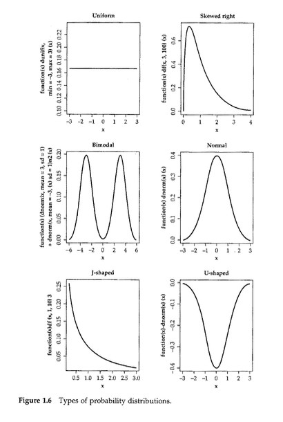

Data modeling
================
Steven Moran & Alena Witzlack-Makarevich

06 March, 2023

- [Data modeling](#data-modeling)
- [Descriptive statistics](#descriptive-statistics)
- [The big picture](#the-big-picture)
- [Hypothesis testing](#hypothesis-testing)
  - [Procedure](#procedure)
  - [Directional vs. non-directional
    hypothesis](#directional-vs-non-directional-hypothesis)
  - [Conceptual steps](#conceptual-steps)
  - [Type I and type II errors](#type-i-and-type-ii-errors)
- [Choosing the right statistic](#choosing-the-right-statistic)
  - [Statistical assumptions](#statistical-assumptions)
  - [Parametric tests](#parametric-tests)
  - [Parametric versus nonparametric
    statistics](#parametric-versus-nonparametric-statistics)
- [Some examples](#some-examples)
  - [Statistical modeling](#statistical-modeling)
- [References](#references)

------------------------------------------------------------------------

This report uses the [R programming
language](https://cran.r-project.org/doc/FAQ/R-FAQ.html) (R Core Team
2021) and the following [R libraries](https://r-pkgs.org/intro.html)
(Wickham et al. 2019; Xie 2021).

``` r
library(tidyverse)
library(knitr)
```

------------------------------------------------------------------------

<!-- 
# Recap
&#10;So far we've talked about:
&#10;* Markdown for communication
* Data vs information
* Data types (from the programming and statistics sides)
* Data wrangling, i.e., data transformation
* Data visualization
&#10;These topics give us the skills to do various things with data, including:
&#10;* Importing
* Tidying
* Transforming
* Visualizing
&#10;These skills helps us undertake exploratory and descriptive analyses.
&#10;-->

# Data modeling

The next step is to **model data**. Scientists are interested in
**discovering/understanding** something about real world phenomena.
Three types of goals:

1.  Describe
2.  Explain
3.  Predict

One goal of **data modeling** is to provide a summary of a data set,
i.e., describe it. Another is to come up with **hypotheses for
descriptive and inference purposes**.

Nolan and Heinzen (2011) define two main branches of modern statistics
(not to be confused with the definitions by Janert (2010) below):

- **Descriptive statistics** organize, summarize, and communicate a
  group of numerical observations.
  - Descriptive statistics describe large amounts of data in a single
    number or in just a few numbers.
  - A single number reporting e.g. the average is often far more useful
    and easier to grasp than a long list of the numbers.
- **Inferential statistics** use sample data to make general estimates
  about the larger population.
  - Inferential statistics infer, or make an intelligent guess about,
    the whole population, i.e. also about the objects not included into
    the study.

One purpose of descriptive statistics is to efficiently summarize
information for visual purposes.

On the other hand, **statistical inference** methods allow you to **draw
a conclusion**, i.e., you infer something, about your data. This allows
us to do things like fit statistical models and understand how they work
and what they tell us about our data, so that we can test our
hypotheses.

# Descriptive statistics

**Descriptive statistics** use [summary
statistics](https://en.wikipedia.org/wiki/Summary_statistics) to
**summarize a set of observations**, including for example:

- [Central tendency](https://en.wikipedia.org/wiki/Central_tendency)
- [Dispersion](https://en.wikipedia.org/wiki/Statistical_dispersion)
- [Shape of the
  distribution](https://en.wikipedia.org/wiki/List_of_probability_distributions)
- [Statistical dependence](https://en.wikipedia.org/wiki/Correlation)

The measure of [central
tendency](https://en.wikipedia.org/wiki/Central_tendency) is one way to
make many data points comprehensible to humans by compressing them into
one value. Central tendency is a descriptive statistic that best
represents the center of a data set i.e. a particular value that all the
data seem to be gathering around it’s the “typical” score.

The most commonly reported measure of central tendency is the **mean**,
the arithmetic average of a group of scores.

The **median** is the middle score of all the scores in a sample when
the scores are arranged in ascending order.

Simply creating a visual representation of the distribution often
reveals its central tendency.

Let’s look at some data about athletes.

``` r
athletes <- read_csv('../4_data_wrangling/datasets/athletes.csv')
```

    ## Rows: 2859 Columns: 12
    ## ── Column specification ────────────────────────────────────────────────────────
    ## Delimiter: ","
    ## chr  (4): gender, name, sport, country
    ## dbl  (7): age, height, weight, gold_medals, silver_medals, bronze_medals, to...
    ## date (1): birthdate
    ## 
    ## ℹ Use `spec()` to retrieve the full column specification for this data.
    ## ℹ Specify the column types or set `show_col_types = FALSE` to quiet this message.

We can quickly visualize the distribution of our variables.

``` r
hist(athletes$height)
```

<!-- -->

``` r
hist(athletes$weight)
```

<!-- -->

``` r
hist(athletes$age)
```

<!-- -->

In a histogram or a polygon of a normal distribution the central
tendency is usually near the highest point

The specific way that data cluster around a distribution’s central
tendency can be measured three different ways:

- [mean](https://en.wikipedia.org/wiki/Mean)
- [median](https://en.wikipedia.org/wiki/Median)
- [mode](https://en.wikipedia.org/wiki/Mode_(statistics))

Or visually:

<figure>

<figcaption aria-hidden="true">Mean, median, mode.</figcaption>
</figure>

Summary statistics only apply to unimodal distributions, i.e.,
distributions that have a single central peak. If this basic assumption
is not met, the your conclusions may be wrong.

And recall the `summary` function that will give us a summary of
descriptive statistics based on the data type in each column.

``` r
summary(athletes)
```

    ##       age          birthdate             gender              height     
    ##  Min.   :15.00   Min.   :1959-02-02   Length:2859        Min.   :1.460  
    ##  1st Qu.:22.00   1st Qu.:1984-10-01   Class :character   1st Qu.:1.680  
    ##  Median :25.00   Median :1988-03-13   Mode  :character   Median :1.760  
    ##  Mean   :25.84   Mean   :1987-10-02                      Mean   :1.752  
    ##  3rd Qu.:29.00   3rd Qu.:1991-05-14                      3rd Qu.:1.820  
    ##  Max.   :55.00   Max.   :1998-12-31                      Max.   :2.060  
    ##                                                          NA's   :139    
    ##      name               weight        gold_medals      silver_medals    
    ##  Length:2859        Min.   : 40.00   Min.   :0.00000   Min.   :0.00000  
    ##  Class :character   1st Qu.: 62.00   1st Qu.:0.00000   1st Qu.:0.00000  
    ##  Mode  :character   Median : 72.00   Median :0.00000   Median :0.00000  
    ##                     Mean   : 73.11   Mean   :0.03358   Mean   :0.03218  
    ##                     3rd Qu.: 83.00   3rd Qu.:0.00000   3rd Qu.:0.00000  
    ##                     Max.   :120.00   Max.   :3.00000   Max.   :2.00000  
    ##                     NA's   :378                                         
    ##  bronze_medals      total_medals        sport             country         
    ##  Min.   :0.00000   Min.   :0.00000   Length:2859        Length:2859       
    ##  1st Qu.:0.00000   1st Qu.:0.00000   Class :character   Class :character  
    ##  Median :0.00000   Median :0.00000   Mode  :character   Mode  :character  
    ##  Mean   :0.03253   Mean   :0.09829                                        
    ##  3rd Qu.:0.00000   3rd Qu.:0.00000                                        
    ##  Max.   :2.00000   Max.   :3.00000                                        
    ## 

# The big picture

Here is the big picture.

 Here’s also a useful
tutorial:

- <http://varianceexplained.org/RData/>

------------------------------------------------------------------------

A bit of history about statistics.

Janert (2010) asks, “what you really need to know about classical
statistics, in the [excellent
book](https://www.oreilly.com/library/view/data-analysis-with/9781449389802/),
*Data analysis with open source tools*. Janert writes:

> > > BASIC CLASSICAL STATISTICS HAS ALWAYS BEEN SOMEWHAT OF A MYSTERY
> > > TO ME: A TOPIC FULL OF OBSCURE notions, such as t-tests and
> > > p-values, and confusing statements like “we fail to reject the
> > > null hypothesis”-—which I can read several times and still not
> > > know if it is saying yes, no, or maybe.\* To top it all off, all
> > > this formidable machinery is then used to draw conclusions that
> > > don’t seem to be all that interesting—it’s usually something about
> > > whether the means of two data sets are the same or different. Why
> > > would I care?

> > > Eventually I figured it out, and I also figured out why the field
> > > seemed so obscure initially. In this chapter, I want to explain
> > > what classical statistics does, why it is the way it is, and what
> > > it is good for. This chapter does not attempt to teach you how to
> > > perform any of the typical statistical methods: this would require
> > > a separate book. (I will make some recommendations for further
> > > reading on this topic at the end of this chapter.) Instead, in
> > > this chapter I will tell you what all these other books omit.

> > > Let me take you on a trip. I hope you know where your towel is.

> > > \*I am not alone—even professional statisticians have the same
> > > experience. See, for example, the preface of Bayesian Statistics.
> > > Peter M. Lee. Hodder & Arnold. 2004.

This chapter is totally worth reading! (So is the whole book.)

It describes, for example, **how did classical statistics come about?**

In the late 19th and early 20th centuries by a small group of people,
mostly in Great Britain, working for example at
[Guinness](https://en.wikipedia.org/wiki/Guinness) and in agriculture.
They had:

- No computational capabilities
- No graphing capabilities
- Very small and very expensive data sets

Their situation, as Janert notes, was basically the **opposite of what
we have today**. Given their limitations, it took a great deal of
ingenuity to solve problems that we – for the most part – no longer
have, e.g.:

- We have lots of computing power
- We have lots of graphing capabilities
- There’s lots of data out there

Instead, today’s modern statistics is largely focused on areas like
Bayesian reasoning, non-parametric tests, resampling, and simulations.

Nevertheless, statistics typically deals with drawing conclusions about
a population by using a representative sample of that population.

- A **population** consists of all the scores of some specified group of
  interest (in texts one uses N to refer to it)
- A **sample** is a subset of a population (n)

Samples are used most often because we are rarely able to study every
object in a population (e.g. every person in the world or in a country,
every language, every sentence ever produced).

When properties of the population are inferred from a sample, we are
undertaking **statistical inference**.

------------------------------------------------------------------------

**Population or sample?**

1.  A principal of a large high school asked five teachers about the
    conditions in the teachers’ lounge.

- What is the sample?
- What is the population?

2.  A poll taken in October 2004, which was funded by the European
    Union, found that 50.8% of the 8,075 married women surveyed in
    Turkey were married without their consent.

- What is the sample?
- What is the population?

3.  Determine whether the data set is a population or a sample. Explain
    your reasoning.

- 1.  The height of each player on a school’s basketball team

- 2.  The amount of energy collected from every wind turbine on a wind
      farm

- 3.  A survey of 500 spectators from a stadium with 42,000 spectators

- 4.  The annual salary of each pharmacist at a pharmacy

- 5.  The cholesterol levels of 20 patients in a hospital with 100
      patients

- 6.  The number of televisions in each U.S. household

- 7.  The final score of each golfer in a tournament

- 8.  The age of every third person entering a clothing store

- 9.  The political party of every U.S. president

- 10. The soil contamination levels at 10 locations near a landfill

# Hypothesis testing

## Procedure

[Hypothesis
testing](https://en.wikipedia.org/wiki/Statistical_hypothesis_testing)
is a way to interpret and draw conclusions about the
[population](https://en.wikipedia.org/wiki/Statistical_population) of a
[sample](https://en.wikipedia.org/wiki/Sample_(statistics)) of data.

- <https://www.scribbr.com/statistics/hypothesis-testing/>
- <https://towardsdatascience.com/hypothesis-testing-in-real-life-47f42420b1f7>
- <http://www.biostathandbook.com/hypothesistesting.html>

The logic of hypothesis testing is as follows. After we have identified
the H0 and H1, we can do only one of two things:

1.  Reject the H0 in favor of the H1
2.  Fail to reject H0 and thus keep it

Null hypothesis testing corresponds to a *reductio ad absurdum* argument
in logic, i.e., a claim is assumed valid if its counter claim is
improbable.

The procedure for deciding is roughly as follows:

1.  Take a random sample from the population
2.  Assume that H0 holds
3.  If the sample data are consistent with the H0, keep H0
4.  If the sample data are inconsistent with the H0, reject the H0 in
    favor of the H1.

Or another way of looking at it:

1.  State your null hypothesis (H0) and alternative hypothesis (H1)
2.  Choose your significance level (aka alpha)
3.  Collect your data (e.g., take a sample the population)
4.  Perform the appropriate statistical test and compute the p-value and
    compare it to the significance level
5.  Decide whether to **reject** the null hypothesis (H0) or **fail to
    reject** it

Or another way of looking at it:

1.  Choose a significance level (alpha)
2.  Formulate a null hypothesis (H0)
3.  Formulate an alternative hypothesis (H1)
4.  Gather data, calculate a test statistic, e.g. T or F
5.  Determine the probability (p-value) of obtaining T or F “or a more
    extreme value” under (H0)
6.  If p ≤ alpha, reject H0

This procedure underlies most inferential statistics used in for example
language sciences, e.g., t-tests, ANOVAs, linear regressions,
mixed-effects regressions – although the steps are not usually
explicitly stated.

The procedure was originally developed by the English statistician
Ronald Fisher in *The Design of Experiments* (1935). The book is
considered a foundation work in experimental design, i.e., it introduced
the concept of the null hypothesis.

**Contemporary science is based on the logic of falsification: it is
impossible to prove that something is right, but it is possible to
reject the opposite.**

In other words – although H0 cannot be proven true, H0 can be proven
false.

**A simple example**:

> > > If someone claims that all swans are white, confirmatory evidence
> > > (in the form of lots of white swans) cannot prove the assertion to
> > > be true. However, contradictory evidence (in the form of a single
> > > black swan) makes it clear that the claim is invalid.

------------------------------------------------------------------------

A note on statistical hypotheses. The null hypothesis (H0) is in essence
a statement that there is **no relationship** between two variables,
e.g.:

- There is no relationship between brain size and intelligence
- There is no relationship between the level of education and income
- There is no relationship between children’s self-esteem and that of
  their parent of the same sex
- There is no relationship between aging and memory loss
- There is no relationship between the amount of carrots eaten and
  ability to see in the dark
- There is no relationship between the number of consonants and number
  of vowels in the languages of the world

The alternative hypothesis (h1) simply states that there **is a
relationship** between two variables. In its simplest forms H1 says only
this:

- There is a relationship between the number of years of education
  people have and their income.
- There is a relationship between people’s gender and how much they talk
  about their emotional problems.
- There is a relationship between birth order and social dominance.
- There is a relationship between the number of speakers of a language
  and the size of phoneme inventory.
- There is a relationship between the order of the verb and the object
  in a clause and the order of a head noun and an adjective in a NP.

------------------------------------------------------------------------

Let’s practice: H0 or H1?

1a. H\_\_\_: There is no difference in the number of lexemes that denote
snow in Eskimo and Yucatec Maya.

1b. H\_\_\_: There are more lexemes that denote snow in Eskimo than in
Yucatec Maya.

2a. H\_\_\_: The more frequent a word, the faster it is recognized in a
lexical decision task.

2b. H\_\_\_: There is no relationship between the frequency of a word
and how fast it is recognized in a lexical decision task.

3a. H\_\_\_: There is a difference in the relative frequencies of
metaphoric expressions used by men and women when they speak about sex.

3b. H\_\_\_: There is no difference in the relative frequencies of
metaphoric expressions used by men and women when they speak about sex.

------------------------------------------------------------------------

## Directional vs. non-directional hypothesis

<!--
A hypothesis can be a statement about the value of a single population characteristic or the values of several population parameters.
&#10;The following are other examples of legitimate hypotheses:
&#10;* μ = 1000, where μ is the mean number of characters in an e-mail message
* p < .01, where p is the proportion of e-mail messages that are spam
&#10;In contrast, the statements x̄= 1000 and p̂ = .01 are not hypotheses, because x̄ (sample mean) and p̂ (sample proportion) are sample characteristics (i.e. statistics, not parameteters).
&#10;***
-->

A **non-directional** (two-tailed) H1 predicts that the independent
variable will have an effect on the dependent variable, but the
direction of the effect is not specified, e.g.:

- there will be **a difference** in how many numbers are correctly
  recalled by children and adults
- there is **no difference** between men and women with respect to
  weight/height

A **directional** hypothesis (one-tailed) predicts the nature of the
effect of the independent variable on the dependent variable, e.g.:

- adults will correctly recall **more** words than children
- men are on average **heavier/taller** than women

------------------------------------------------------------------------

Let’s practice: Directional or non-directional?

1a. H0: There is no difference in the number of lexemes that denote snow
in Eskimo and Yucatec Maya.

1b. H1: There are more lexemes that denote snow in Eskimo than in
Yucatec Maya.

2a. H0: There is no relationship between the frequency of a word and how
fast it is recognized in a lexical decision task.

2b. H1: The more frequent a word, the faster it is recognized in a
lexical decision task.

3a. H0: There is no difference in the relative frequencies of metaphoric
expressions used by men and women when they speak about sex.

3b. H1: There is a difference in the relative frequencies of metaphoric
expressions used by men and women when they speak about sex.

## Conceptual steps

Here is a figure of the conceptual steps.

<figure>

<figcaption aria-hidden="true">Conceptual steps.</figcaption>
</figure>

## Type I and type II errors

In general:

<figure>

<figcaption aria-hidden="true">Type I and type II errors.</figcaption>
</figure>

In medical statistics, false positives and false negatives are concepts
analogous to type I and type II errors in statistical hypothesis
testing:

<figure>

<figcaption aria-hidden="true">Conceptual steps.</figcaption>
</figure>

And in machine learning e.g., for a classifier spam vs. not spam:

<figure>

<figcaption aria-hidden="true">Conceptual steps.</figcaption>
</figure>

# Choosing the right statistic

**As data scientists, we may or may not be seasoned statisticians!**

One confusing aspect for scientists without a statistics background is:

- **Which statistical test do I use?**

This question involves asking what are the relevant assumptions of the
common statistical tests and when should I use which?

To answer which kind of statistical test you should ask:

- **What kind of distribution does my data follow?**

Different tests assume different distributions. In other words, how is
your data shaped? Hint: visualize it!

<figure>

<figcaption aria-hidden="true">Johnson 2008, pg. 14</figcaption>
</figure>

A note about distributions:

- Parametric analyses are tests for which we have prior knowledge of the
  population distribution, e.g., we know the distribution is normal.
  They also include tests in which we can approximate a normal
  distribution with the [central limit
  therom](https://en.wikipedia.org/wiki/Central_limit_theorem).

- Non-parametric analyses are tests that do not make any assumptions
  about the parameters of the population under study, i.e., there is no
  known distribution. This is why they are also called distribution-free
  tests.

And like our [discussion on which plots to
use](https://github.com/bambooforest/IntroDataScience/tree/main/6_data_visualization#which-plots-to-use)
to visualize you data:

- **You also need to know what your data types are!**

How many variables do you have?

Wow you going to test them, e.g., are you **comparing** two
distributions?

As with the determining which [plot to
use](https://github.com/bambooforest/IntroDataScience/tree/main/6_data_visualization#which-plots-to-use),
note there are many resources out there to help you identify which
statistical test to use!

- <https://towardsdatascience.com/statistical-testing-understanding-how-to-select-the-best-test-for-your-data-52141c305168>

- <https://www.scribbr.com/statistics/statistical-tests/>

- <https://dacg.in/2018/11/17/statistical-test-cheat-sheet/>

## Statistical assumptions

Statistical tests make assumptions about the data being tested. If the
assumptions for a given statistical test are violated, then the test is
not valid and the results may also not be valid.

1.  **Independence of observations**: the observations/variables you
    include in your test should not be related(e.g. several tests from a
    same test subject are not independent, while several tests from
    multiple different test subjects are independent)

2.  **Homogeneity of variance**: the “variance” within each group is
    being compared should be similar to the rest of the group variance.
    If a group has a bigger variance than the other(s) this will limit
    the test’s effectiveness.

3.  **Normality of data**: the data follows a normal distribution,
    normality means that the distribution of the test is normally
    distributed (or bell-shaped) with mean 0, with 1 standard deviation
    and a symmetric bell-shaped curve.

## Parametric tests

Parametric tests are the ones that can only used on data that confirm to
the **three statistical assumptions** above.

1.  **Regression tests**: used to test cause-and-effect relationships,
    e.g., if the change in one or more continuous variable predicts
    change in another variable.

- Simple linear regression: tests how a change in the predictor variable
  predicts the level of change in the outcome variable.

- Multiple linear regression: tests how changes in the combination of
  two or more predictor variables predict the level of change in the
  outcome variable

- Logistic regression: used to describe data and to explain the
  relationship between one dependent (binary) variable and one or more
  nominal, ordinal, interval or ratio-level independent variable(s).

2.  **Comparison tests**: look for the difference between the means of
    variables, i.e., comparison of means.

- T-tests are used when comparing the means of precisely two groups,
  e.g., the average heights of men and women.

- Independent t-test: test for the difference between the same variable
  from different populations, e.g., comparing dogs to cats.

- ANOVA and MANOVA tests are used to compare the means of more than two
  groups or more, e.g., the average weights of children, teenagers, and
  adults.

3.  **Correlation tests**: test for an association between variable
    checking whether two variables are related.

- Pearson Correlation: test for the strength of the association between
  two continuous variables.

- Spearman Correlation: tests for the strength of the association
  between two ordinal variables (note: it does not rely on the
  assumption of normally distributed data)

- Chi-Square Test: tests for the strength of the association between two
  categorical variables.

Understand your data and look at these flow charts, cheat sheets, etc.,
to figure out which test to use:

- <https://dacg.in/2018/11/17/statistical-test-cheat-sheet/>

- <https://www.scribbr.com/statistics/statistical-tests/>

- <https://towardsdatascience.com/statistical-testing-understanding-how-to-select-the-best-test-for-your-data-52141c305168>

## Parametric versus nonparametric statistics

Parametric analyses are tests for which we have prior knowledge of the
population distribution, e.g., we know the distribution is normal. They
also include tests in which we can approximate a normal distribution
with the [central limit
therom](https://en.wikipedia.org/wiki/Central_limit_theorem).

Non-parametric analyses are tests that do not make any assumptions about
the parameters of the population under study, i.e., there is no known
distribution. This is why they are also called distribution-free tests.

<figure>

<figcaption aria-hidden="true">Hypothesis testing.</figcaption>
</figure>

**Ask**: what are the assumptions of the statistical test?

# Some examples

Comparison tests test for meaningful differences between group means.
They are used to test whether there is a statistically significant
difference between a categorical variable on the mean value of another
variable.

- [Comparing two groups](../case_studies/F1/)
- [ANOVA](../case_studies/ANOVA/)

## Statistical modeling

Statistical modeling is an attempt to describe some part of the real
world in mathematical terms.

Recall our discussion on [data types in
statistics](https://github.com/bambooforest/IntroDataScience/tree/main/3_data#data-types-in-statistics).

The independent variable (predictor variable) is the variable that is
being manipulated, so that we can observe if there is an effect on the
dependent variable (outcome variable).

- Independent variable(s) – Predictor variable(s)
- Dependent variable(s) – Outcome/Output variable(s)

The relevant mathematical concept is the one of **function**. Consider
for example the input of `height` and output of `weight` with our
`atheletes` data.

Here is the data:

``` r
head(athletes) %>% kable()
```

| age | birthdate  | gender | height | name              | weight | gold_medals | silver_medals | bronze_medals | total_medals | sport            | country       |
|----:|:-----------|:-------|-------:|:------------------|-------:|------------:|--------------:|--------------:|-------------:|:-----------------|:--------------|
|  17 | 1996-04-12 | Male   |   1.72 | Aaron Blunck      |     68 |           0 |             0 |             0 |            0 | Freestyle Skiing | United States |
|  27 | 1986-05-14 | Male   |   1.85 | Aaron March       |     85 |           0 |             0 |             0 |            0 | Snowboard        | Italy         |
|  21 | 1992-06-30 | Male   |   1.78 | Abzal Azhgaliyev  |     68 |           0 |             0 |             0 |            0 | Short Track      | Kazakhstan    |
|  21 | 1992-05-25 | Male   |   1.68 | Abzal Rakimgaliev |     NA |           0 |             0 |             0 |            0 | Figure Skating   | Kazakhstan    |
|  21 | 1992-07-30 | Male   |   1.86 | Adam Barwood      |     82 |           0 |             0 |             0 |            0 | Alpine Skiing    | New Zealand   |
|  21 | 1992-12-18 | Male   |   1.75 | Adam Cieslar      |     57 |           0 |             0 |             0 |            0 | Nordic Combined  | Poland        |

And its contents:

``` r
str(athletes)
```

    ## spc_tbl_ [2,859 × 12] (S3: spec_tbl_df/tbl_df/tbl/data.frame)
    ##  $ age          : num [1:2859] 17 27 21 21 21 21 18 23 17 21 ...
    ##  $ birthdate    : Date[1:2859], format: "1996-04-12" "1986-05-14" ...
    ##  $ gender       : chr [1:2859] "Male" "Male" "Male" "Male" ...
    ##  $ height       : num [1:2859] 1.72 1.85 1.78 1.68 1.86 1.75 1.7 1.78 1.63 1.62 ...
    ##  $ name         : chr [1:2859] "Aaron Blunck" "Aaron March" "Abzal Azhgaliyev" "Abzal Rakimgaliev" ...
    ##  $ weight       : num [1:2859] 68 85 68 NA 82 57 76 80 NA 56 ...
    ##  $ gold_medals  : num [1:2859] 0 0 0 0 0 0 0 0 0 0 ...
    ##  $ silver_medals: num [1:2859] 0 0 0 0 0 0 0 0 0 0 ...
    ##  $ bronze_medals: num [1:2859] 0 0 0 0 0 0 0 0 0 0 ...
    ##  $ total_medals : num [1:2859] 0 0 0 0 0 0 0 0 0 0 ...
    ##  $ sport        : chr [1:2859] "Freestyle Skiing" "Snowboard" "Short Track" "Figure Skating" ...
    ##  $ country      : chr [1:2859] "United States" "Italy" "Kazakhstan" "Kazakhstan" ...
    ##  - attr(*, "spec")=
    ##   .. cols(
    ##   ..   age = col_double(),
    ##   ..   birthdate = col_date(format = ""),
    ##   ..   gender = col_character(),
    ##   ..   height = col_double(),
    ##   ..   name = col_character(),
    ##   ..   weight = col_double(),
    ##   ..   gold_medals = col_double(),
    ##   ..   silver_medals = col_double(),
    ##   ..   bronze_medals = col_double(),
    ##   ..   total_medals = col_double(),
    ##   ..   sport = col_character(),
    ##   ..   country = col_character()
    ##   .. )
    ##  - attr(*, "problems")=<externalptr>

------------------------------------------------------------------------

One way to look at that relationship is to **plot the input** on the
x-axis and the output on the y-axis in a scatter plot.

``` r
ggplot(athletes, aes(height, weight)) +
  geom_point()
```

    ## Warning: Removed 380 rows containing missing values (`geom_point()`).

<!-- -->

One way to test whether there is a relationship is to use [linear
regression](https://en.wikipedia.org/wiki/Linear_regression).

``` r
ggplot(athletes, aes(height, weight)) +
  geom_point() +
  geom_smooth(method='lm')
```

    ## `geom_smooth()` using formula = 'y ~ x'

    ## Warning: Removed 380 rows containing non-finite values (`stat_smooth()`).

    ## Warning: Removed 380 rows containing missing values (`geom_point()`).

<!-- -->

Like other statistical tests, **you will have to know the (four) main
assumptions** for linear regression, i.e.:

- [Independence](https://en.wikipedia.org/wiki/Independence_(probability_theory))
  of observations (aka no
  [autocorrelation](https://en.wikipedia.org/wiki/Autocorrelation))
- [Normality](https://en.wikipedia.org/wiki/Normal_distribution)
- [Linearity](https://en.wikipedia.org/wiki/Linear_regression)
- [Homoscedasticity](https://en.wikipedia.org/wiki/Homoscedasticity_and_heteroscedasticity)
  (aka homogeneity of variance)

Two events are **independent** if the occurrence of one event does not
affect the chances of the occurrence of the other event.

We test for **normality** to see whether a set of data is distributed in
a way that is consistent with a [normal
distribution](https://en.wikipedia.org/wiki/Normal_distribution), when
our statistical test requires that the data points are normally
distributed.

**Linearity** is demonstrated when the mean values of the outcome
variable (dependent variable) for each increment of the predictors
(independent variables) lies along a straight line.

**Homoscedasticity** (homogeneity of variances) is an assumption of
equal or similar variances in different groups being compared.
[Parametric statistical
test](https://en.wikipedia.org/wiki/Parametric_statistics) assume that
data points in the sample come from a population that can be modeled by
a [probability
distribution](https://en.wikipedia.org/wiki/Probability_distribution)
(i.e., a mathematical function that describes the probabilities of
occurrence of the outcomes in an experiment) and that has a fixed set of
[statistical
parameters](https://en.wikipedia.org/wiki/Statistical_parameter). This
assumption is important because parametric statistical tests are
sensitive to any dissimilarities and uneven variance in samples will
bias and skew the results.

We will talk more about linear models in the follow weeks, but here is a
good and simple overview:

- <https://www.scribbr.com/statistics/linear-regression-in-r/>

------------------------------------------------------------------------

Let’s look at a brief example.

For height and weight, we only have one independent variable and one
dependent variable for each athlete, so we don’t need to test for any
hidden relationships the among variables. In other words, we have
independence of observations.

We need to check if the dependent variable is normally distributed. We
can quickly visualize it. Does it look normal?

``` r
hist(athletes$height)
```

<!-- -->

Another way to look for normality is with a quantile-quantile plot (Q-Q
plot), which is a graphical tool to assess whether the data come from
some probability distribution. It is a scatter plot that plots two sets
of [quantiles](https://en.wikipedia.org/wiki/Quantile) against each
other. If for example, we have a relatively straight line, we may assume
that our data points come from a normal distribution.

``` r
qqnorm(athletes$height, pch = 1, frame = FALSE) # Create the Q-Qplot
qqline(athletes$height, col = "steelblue", lwd = 2) # Add a blue line for reference
```

<!-- -->

As we saw above, the data are linearly distributed. Here’s another way
to quickly visualize the x and y variables.

``` r
plot(weight ~ height, data = athletes)
```

<!-- -->

[Homoscedasticity](https://en.wikipedia.org/wiki/Homoscedasticity_and_heteroscedasticity)
means that the prediction error does not change significantly over the
range of prediction of the model. We will discuss this more in the
coming weeks – as well as what the output means.

``` r
lm <- lm(weight ~ height, data = athletes)
summary(lm)
```

    ## 
    ## Call:
    ## lm(formula = weight ~ height, data = athletes)
    ## 
    ## Residuals:
    ##      Min       1Q   Median       3Q      Max 
    ## -28.4176  -5.3995  -0.3995   5.0461  27.8007 
    ## 
    ## Coefficients:
    ##             Estimate Std. Error t value Pr(>|t|)    
    ## (Intercept) -147.362      2.974  -49.55   <2e-16 ***
    ## height       125.454      1.690   74.23   <2e-16 ***
    ## ---
    ## Signif. codes:  0 '***' 0.001 '**' 0.01 '*' 0.05 '.' 0.1 ' ' 1
    ## 
    ## Residual standard error: 7.613 on 2477 degrees of freedom
    ##   (380 observations deleted due to missingness)
    ## Multiple R-squared:  0.6899, Adjusted R-squared:  0.6898 
    ## F-statistic:  5510 on 1 and 2477 DF,  p-value: < 2.2e-16

We can say there is a significant positive relationship between height
and weight of these athletes (p-value \< 0.001).

------------------------------------------------------------------------

Statistical tests are about interpreting data. If we want to interpret
our data with formal procedures and to make claims about the
distribution of our data or whether two data sets differ fundamentally
from each other, then we rely on hypothesis testing.

# References

<div id="refs" class="references csl-bib-body hanging-indent">

<div id="ref-Janert2010" class="csl-entry">

Janert, Philipp K. 2010. *Data Analysis with Open Source Tools*.
O’Reilly.

</div>

<div id="ref-Nolan2011" class="csl-entry">

Nolan, Susan A, and Thomas Heinzen. 2011. *Statistics for the Behavioral
Sciences*. Macmillan.

</div>

<div id="ref-R" class="csl-entry">

R Core Team. 2021. *R: A Language and Environment for Statistical
Computing*. Vienna, Austria: R Foundation for Statistical Computing.
<https://www.R-project.org/>.

</div>

<div id="ref-tidyverse" class="csl-entry">

Wickham, Hadley, Mara Averick, Jennifer Bryan, Winston Chang, Lucy
D’Agostino McGowan, Romain François, Garrett Grolemund, et al. 2019.
“Welcome to the <span class="nocase">tidyverse</span>.” *Journal of Open
Source Software* 4 (43): 1686. <https://doi.org/10.21105/joss.01686>.

</div>

<div id="ref-knitr" class="csl-entry">

Xie, Yihui. 2021. *Knitr: A General-Purpose Package for Dynamic Report
Generation in r*. <https://yihui.org/knitr/>.

</div>

</div>
