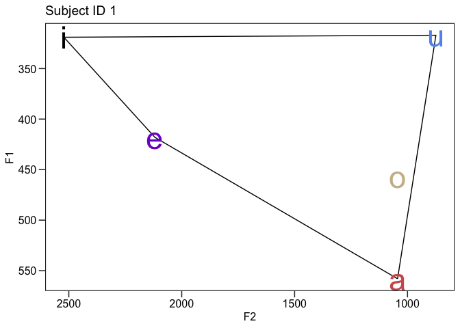
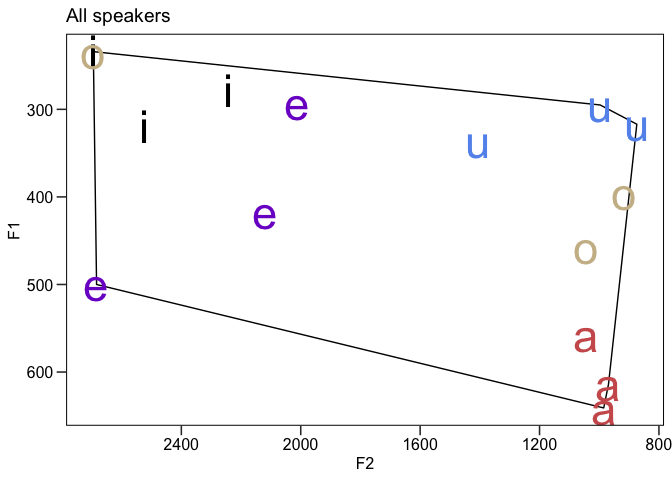
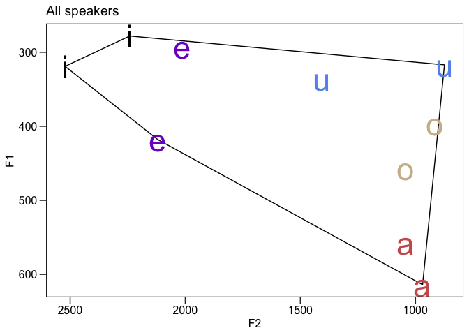
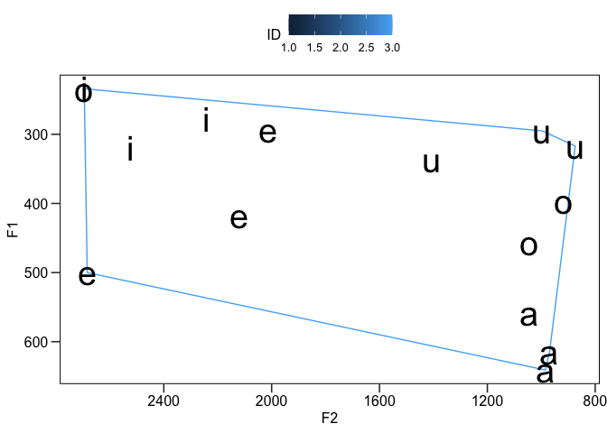
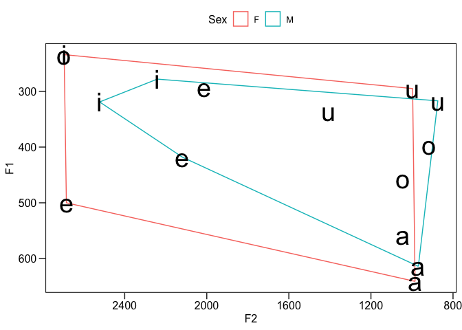
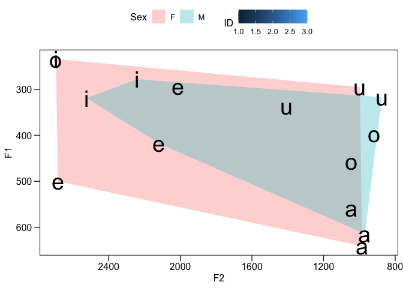
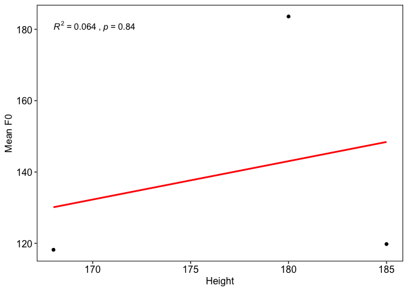

Vowel formants example
================
Steven Moran
(13 February, 2023)

- [Getting started](#getting-started)
  - [R packages](#r-packages)
  - [Load our vowel data](#load-our-vowel-data)
  - [Have a look at the raw data](#have-a-look-at-the-raw-data)
- [Working with the data](#working-with-the-data)
  - [Overview](#overview)
  - [Single speaker](#single-speaker)
  - [All speakers](#all-speakers)
  - [Filter out outliers](#filter-out-outliers)
- [Analyses](#analyses)
  - [Phonetic differences by sex](#phonetic-differences-by-sex)
  - [Differences in pitch](#differences-in-pitch)
  - [Pitch versus height](#pitch-versus-height)

# Getting started

## R packages

In R, you need to install (once) any R software package (aka library)
that you want to use, before you load it with the `library()` function
each time that you run a script or RMarkdown file.

This code will check whether or not you have those packages, and if not,
will install them and load the packages.

``` r
if(!require("tidyverse")) install.packages("tidyverse")
if(!require("ggpubr")) install.packages("ggpubr")
if(!require("devtools")) install.packages("devtools")
library(devtools)
if(!require("ggConvexHull")) devtools::install_github("cmartin/ggConvexHull")
```

Normally, once a package is already installed, you simply load it with
the `library()` function, like this:

``` r
library(tidyverse)
library(ggpubr)
library(ggConvexHull)
```

The [tidyverse](https://www.tidyverse.org) package will install several
[R packages](https://www.tidyverse.org/packages/) including:

- [ggplot](https://ggplot2.tidyverse.org) for creating nice looking
  plots
- [dplyr](https://dplyr.tidyverse.org) for manipulating data easily

We are going to additionally use
[ggpubr](http://www.sthda.com/english/wiki/ggpubr-create-easily-publication-ready-plots)
package because it is helpful in making [professional looking
plots](https://medium.com/swlh/beautiful-charts-with-r-and-ggpubr-c94122d6b7c6).

And the [ggConvexHull](https://github.com/cmartin/ggConvexHull) package,
which extends the `geom_polyon()` function in the ggplot package, so
that we can add a [convex
hull](https://en.wikipedia.org/wiki/Convex_hull) around our vowel
polygon data. This package is available via GitHub and hence the
[devtools](https://devtools.r-lib.org) package.

## Load our vowel data

Let’s load the vowel formants data from our measurements in class.

First download it from the shared Google sheets as a [CSV
file](https://en.wikipedia.org/wiki/Comma-separated_values).

I renamed my downloaded file to `data.csv` to remove the spaces in the
filename (you don’t have to) and I saved it in the same directory as
this `README.Rmd` file. If you want to get the current working directory
in RStudio (or R) you can use this command:

``` r
getwd()
```

    ## [1] "/Users/stiv/GitHub/APY313/case_studies/formants"

In RStudio, I [set the working
directory](https://support.rstudio.com/hc/en-us/articles/200711843-Working-Directories-and-Workspaces-in-the-RStudio-IDE)
to the directory that contains this script. In this folder with the
script, I also put the downloaded vowels data.

Make your life easier and **put both files in the same folder!**

You can set the working directory a la the link above or you can also do
it manually with the `setwd()` function, e.g.:

``` r
# setwd('/Users/stiv/GitHub/APY313/case_studies/formants')
```

------------------------------------------------------------------------

Let’s load the data that’s in the same directory as this script.

``` r
df <- read_csv('data.csv')

# If you want the data in a different directory, you can give `read_csv()` the full path! E.g.:
# df <- read_csv('/Users/stiv/Downloads/data.csv')
```

With the `read_csv()` function we read the [CSV
file](https://en.wikipedia.org/wiki/Comma-separated_values) – a comma
delimited text file that represents [tabular (i.e. table)
data](https://en.wikipedia.org/wiki/Table_(information)) as rows and
columns.

The `read_csv()` function reads the file into R as a [data
frame](http://www.r-tutor.com/r-introduction/data-frame), essentially a
table![^1]

## Have a look at the raw data

Let’s have a look at the data. The function structure `str()` shows the
data structure of the loaded data frame. It tells you what the columns
are, what each column’s data type is (e.g. `chr` means the rows in that
column include characters; `num` means they include numbers) – followed
by human rows there are and examples of the first few rows.

``` r
str(df)
```

    ## spc_tbl_ [15 × 10] (S3: spec_tbl_df/tbl_df/tbl/data.frame)
    ##  $ ID    : num [1:15] 1 1 1 1 1 2 2 2 2 2 ...
    ##  $ Word  : chr [1:15] "heed" "hayed" "hawed" "who'd" ...
    ##  $ Vowel : chr [1:15] "i" "e" "a" "u" ...
    ##  $ F0    : num [1:15] 120 115 115 122 119 217 170 139 172 220 ...
    ##  $ F1    : num [1:15] 319 418 558 317 457 234 500 641 295 235 ...
    ##  $ F2    : num [1:15] 2522 2119 1044 874 1044 ...
    ##  $ F3    : num [1:15] 3299 3631 2677 2668 2587 ...
    ##  $ Sex   : chr [1:15] "M" "M" "M" "M" ...
    ##  $ L1    : chr [1:15] "English" "English" "English" "English" ...
    ##  $ Height: num [1:15] 168 168 168 168 168 180 180 180 180 180 ...
    ##  - attr(*, "spec")=
    ##   .. cols(
    ##   ..   ID = col_double(),
    ##   ..   Word = col_character(),
    ##   ..   Vowel = col_character(),
    ##   ..   F0 = col_double(),
    ##   ..   F1 = col_double(),
    ##   ..   F2 = col_double(),
    ##   ..   F3 = col_double(),
    ##   ..   Sex = col_character(),
    ##   ..   L1 = col_character(),
    ##   ..   Height = col_double()
    ##   .. )
    ##  - attr(*, "problems")=<externalptr>

The function `head()` shows us the first few rows, so we can have an
idea of its contents.

``` r
head(df)
```

    ## # A tibble: 6 × 10
    ##      ID Word  Vowel    F0    F1    F2    F3 Sex   L1      Height
    ##   <dbl> <chr> <chr> <dbl> <dbl> <dbl> <dbl> <chr> <chr>    <dbl>
    ## 1     1 heed  i       120   319  2522  3299 M     English    168
    ## 2     1 hayed e       115   418  2119  3631 M     English    168
    ## 3     1 hawed a       115   558  1044  2677 M     English    168
    ## 4     1 who'd u       122   317   874  2668 M     English    168
    ## 5     1 hoed  o       119   457  1044  2587 M     English    168
    ## 6     2 heed  i       217   234  2695  3460 F     English    180

The function `tail()` gives us the last few rows.

``` r
tail(df)
```

    ## # A tibble: 6 × 10
    ##      ID Word  Vowel    F0    F1    F2    F3 Sex   L1      Height
    ##   <dbl> <chr> <chr> <dbl> <dbl> <dbl> <dbl> <chr> <chr>    <dbl>
    ## 1     2 hoed  o       220   235  2695  3467 F     English    180
    ## 2     3 heed  i       111   278  2241  2948 M     French     185
    ## 3     3 hayed e       101   293  2013  2550 M     French     185
    ## 4     3 hawed a       101   614   969  2598 M     French     185
    ## 5     3 who'd u       105   336  1406  2830 M     French     185
    ## 6     3 hoed  o       181   396   917  2777 M     French     185

We can also simply ask for the dimensions of the data frame (table!)
with the `dim()` function. This tells us the number of **rows**
(i.e. observations) by the number of **columns** (i.e. variables).

``` r
dim(df)
```

    ## [1] 15 10

Recall from class that every data has a [data
type](https://github.com/bambooforest/APY313/tree/main/3_data#data-types-in-computer-programming).
We can ask R to tell us the data type with the `class()` function:

``` r
class(df)
```

    ## [1] "spec_tbl_df" "tbl_df"      "tbl"         "data.frame"

Or if you want to know the data type of a specific column in the table.

``` r
class(df$ID)
```

    ## [1] "numeric"

The `$` in R is used to access specific columns! You can access each
column by its name, e.g.:

``` r
df$Word
```

    ##  [1] "heed"  "hayed" "hawed" "who'd" "hoed"  "heed"  "hayed" "hawed" "who'd"
    ## [10] "hoed"  "heed"  "hayed" "hawed" "who'd" "hoed"

# Working with the data

## Overview

Above we had a quick look at the raw data, which you can also do
directly with RStudio by clicking on the dataframe in the Environment
tab.

There are lots of ways of doing preliminary data analysis and one great
way is to visualize the data!

Recall our discussion of how the International Phonetic Alphabet (IPA)
[vowel chart](https://en.wikipedia.org/wiki/Vowel_diagram) looks – head
faces left, vertical access is the jaw’s height (closed to open) and the
horizontal access is the position of the tongue (front to back in the
mouth).

------------------------------------------------------------------------

## Single speaker

Let’s look at one speaker in our sample. This is where the data
manipulation R package [dplyr](https://dplyr.tidyverse.org) comes in
handy! We will talk about how to use these functions [in
class](https://github.com/bambooforest/APY313/tree/main/4_data_wrangling).

The dplyr package has several functions that allow us to `filter()` rows
and to `select()` columns (among many other useful things!).

Let’s filter out a single speaker and plot their vowels. You can set the
ID to yourself!

``` r
single_speaker <- df %>% filter(ID == 1)
```

Above, we have saved the output of filtering by `ID == 1` (read “subject
ID equals one”) to a new data frame and named it `single_speaker`. Let’s
have a look.

``` r
single_speaker
```

    ## # A tibble: 5 × 10
    ##      ID Word  Vowel    F0    F1    F2    F3 Sex   L1      Height
    ##   <dbl> <chr> <chr> <dbl> <dbl> <dbl> <dbl> <chr> <chr>    <dbl>
    ## 1     1 heed  i       120   319  2522  3299 M     English    168
    ## 2     1 hayed e       115   418  2119  3631 M     English    168
    ## 3     1 hawed a       115   558  1044  2677 M     English    168
    ## 4     1 who'd u       122   317   874  2668 M     English    168
    ## 5     1 hoed  o       119   457  1044  2587 M     English    168

Now let’s plot Subject ID 1’s vowel formant values for F1 and F2.

``` r
ggplot(single_speaker, aes(x = F2, y = F1, color = Vowel)) + 
  geom_convexhull(alpha = 0, colour = "black") +
  geom_text(aes(label = Vowel), size = 12) +
  scale_x_reverse() +
  scale_y_reverse() +
  coord_cartesian() +
  theme_pubr(border = TRUE, legend = "none") +
  theme(axis.ticks.length = unit(.25, "cm")) +
  scale_color_manual(
    name = "Vowel",
    values = c(
      "a" = "indianred",
      "i" = "black",
      "u" = "cornflowerblue",
      "o" = "wheat3",
      "e" = "purple3"
    )
  ) +
  ggtitle('Subject ID 1')
```

<!-- -->

## All speakers

Let’s plot all of the F1 and F2 formants in our sample and see what they
look like. We use the `ggplot()` function with lots of other functions.
This is complicated – do not worry, we will go through this mess in
class.

``` r
ggplot(df, aes(x = F2, y = F1, color = Vowel)) + 
  geom_convexhull(alpha = 0, colour = "black") +
  geom_text(aes(label = Vowel), size = 12) +
  scale_x_reverse() +
  scale_y_reverse() +
  coord_cartesian() +
  theme_pubr(border = TRUE, legend = "none") +
  theme(axis.ticks.length = unit(.25, "cm")) +
  scale_color_manual(
    name = "Vowel",
    values = c(
      "a" = "indianred",
      "i" = "black",
      "u" = "cornflowerblue",
      "o" = "wheat3",
      "e" = "purple3"
    )
  ) +
  ggtitle('All speakers')
```

<!-- -->

This isn’t a very normal looking vowel chart! We seem to have some
outliers and/or mistakes in formant measurements, e.g., the “e” vowel in
the bottom left corner is way too high in terms of F1 and F2
frequencies.

## Filter out outliers

If we have outliers in our data, we can filter them out for exploratory
purposes. For example, perhaps we find some data points (observations)
that are missing data or perhaps some mistakes were made in the data
collection. (Note that you should never remove outliers in real
scientific experiments!)

First, let’s check that all subjects have recorded all five vowels.

This code is a bit complex, but we will discuss it in class. By using
`dplyr` we can “pipe” data frames (table data) into functions and
manipulate the data.

Here we group by `ID`, i.e., we group each subjects responses into their
own groups, and then we count (by “summarizing”) how many rows (`n()`
function) are in each group – and we do so by creating a new column
called `vowels`.

``` r
df %>% group_by(ID) %>% summarize(vowels = n())
```

    ## # A tibble: 3 × 2
    ##      ID vowels
    ##   <dbl>  <int>
    ## 1     1      5
    ## 2     2      5
    ## 3     3      5

We will pretend that subject ID 2 does not have 5 observations. What we
can do is remove that subject from our data set like this:

``` r
temp <- df %>% filter(ID != 2)
```

We saved the new data frame in a “temporary” data frame, so that we
still have the full data in the `df` data frame.

Now let’s revisualize what’s left. We can use the same code we used
above.

``` r
ggplot(temp, aes(x = F2, y = F1, color = Vowel)) + 
  geom_convexhull(alpha = 0, colour = "black") +
  geom_text(aes(label = Vowel), size = 12) +
  scale_x_reverse() +
  scale_y_reverse() +
  coord_cartesian() +
  theme_pubr(border = TRUE, legend = "none") +
  theme(axis.ticks.length = unit(.25, "cm")) +
  scale_color_manual(
    name = "Vowel",
    values = c(
      "a" = "indianred",
      "i" = "black",
      "u" = "cornflowerblue",
      "o" = "wheat3",
      "e" = "purple3"
    )
  ) +
  ggtitle('All speakers')
```

<!-- -->

See how the vowel chart changes. If we have great or more outliers, we
will see more change.

------------------------------------------------------------------------

For each speaker, we can add the vowel polygon lines.

``` r
ggplot(df, aes(x = F2, y = F1)) +
  geom_convexhull(alpha = 0, aes(colour = ID)) +
  geom_text(aes(label = Vowel), size = 10) +
  scale_x_reverse() +
  scale_y_reverse() +
  coord_cartesian() +
  theme_pubr(border = TRUE) +
  theme(axis.ticks.length = unit(.25, "cm"))
```

<!-- -->

# Analyses

## Phonetic differences by sex

Let’s plot individual vowel polygons by the reported sex of the speaker.
As we expect from the literature on [phonetic differences between male
and female
speech](https://compass.onlinelibrary.wiley.com/doi/abs/10.1111/j.1749-818X.2009.00125.x),
the vowel polygon of the women in our sample displays greater acoustic
range than the men.

``` r
ggplot(df, aes(x = F2, y = F1)) +
  geom_convexhull(alpha = 0, aes(colour = Sex)) +
  geom_text(aes(label = Vowel), size = 10) +
  scale_x_reverse() +
  scale_y_reverse() +
  coord_cartesian() +
  theme_pubr(border = TRUE) +
  theme(axis.ticks.length = unit(.25, "cm"))
```

<!-- -->

We can also plot individual vowel polygon spaces by sex and filled in by
color.

``` r
ggplot(df, aes(x = F2, y = F1)) +
  geom_convexhull(alpha = 0.3, lwd = 0, aes(colour = ID, fill = Sex)) +
  geom_text(aes(label = Vowel), size = 10) +
  scale_x_reverse() +
  scale_y_reverse() +
  coord_cartesian() +
  theme_pubr(border = TRUE) +
  theme(axis.ticks.length = unit(.25, "cm"))
```

    ## Warning: Using `size` aesthetic for lines was deprecated in ggplot2 3.4.0.
    ## ℹ Please use `linewidth` instead.

<!-- -->

## Differences in pitch

Recall that we also recorded our F0 – our fundamental frequency, which
we perceive as our pitch. This is in the F0 column of our data frame:

``` r
head(df)
```

    ## # A tibble: 6 × 10
    ##      ID Word  Vowel    F0    F1    F2    F3 Sex   L1      Height
    ##   <dbl> <chr> <chr> <dbl> <dbl> <dbl> <dbl> <chr> <chr>    <dbl>
    ## 1     1 heed  i       120   319  2522  3299 M     English    168
    ## 2     1 hayed e       115   418  2119  3631 M     English    168
    ## 3     1 hawed a       115   558  1044  2677 M     English    168
    ## 4     1 who'd u       122   317   874  2668 M     English    168
    ## 5     1 hoed  o       119   457  1044  2587 M     English    168
    ## 6     2 heed  i       217   234  2695  3460 F     English    180

Again, we access any column in the data frame with the `$` operator with
the name of the column as the suffix, e.g. let’s get all values (aka
observations, rows) of F0:

``` r
df$F0
```

    ##  [1] 120 115 115 122 119 217 170 139 172 220 111 101 101 105 181

We can also use various R functions on columns. For example, you can
summarize numerical values from a column with the `summary()` function!

``` r
summary(df$F0)
```

    ##    Min. 1st Qu.  Median    Mean 3rd Qu.    Max. 
    ##   101.0   113.0   120.0   140.5   171.0   220.0

Perhaps we want to summarize the F0 by sex? In “[base
R](https://iqss.github.io/dss-workshops/R/Rintro/base-r-cheat-sheet.pdf)”:

``` r
# Get a column by name
df$F0
```

    ##  [1] 120 115 115 122 119 217 170 139 172 220 111 101 101 105 181

``` r
# Get rows by filtering the contents of a colum; here by "sex is F(emale)"
df[df$Sex == "F", ]
```

    ## # A tibble: 5 × 10
    ##      ID Word  Vowel    F0    F1    F2    F3 Sex   L1      Height
    ##   <dbl> <chr> <chr> <dbl> <dbl> <dbl> <dbl> <chr> <chr>    <dbl>
    ## 1     2 heed  i       217   234  2695  3460 F     English    180
    ## 2     2 hayed e       170   500  2684  3540 F     English    180
    ## 3     2 hawed a       139   641   985  3118 F     English    180
    ## 4     2 who'd u       172   295   997  2582 F     English    180
    ## 5     2 hoed  o       220   235  2695  3467 F     English    180

``` r
# Get just the contents of the column we want by the filter -- ugh this is painful!
df[df$Sex == "F", ]$F0
```

    ## [1] 217 170 139 172 220

``` r
# Now let's summarize that mess
summary(df[df$Sex == "F", ]$F0)
```

    ##    Min. 1st Qu.  Median    Mean 3rd Qu.    Max. 
    ##   139.0   170.0   172.0   183.6   217.0   220.0

``` r
# And the men
summary(df[df$Sex == "M", ]$F0)
```

    ##    Min. 1st Qu.  Median    Mean 3rd Qu.    Max. 
    ##   101.0   106.5   115.0   119.0   119.8   181.0

Men in the sample have on average lower pitch.

## Pitch versus height

Lastly, let’s see if there is a correlation between one’s height and
one’s F0.

First, let’s get the data we want by “grouping” the height variable and
summarizing the mean F0 for each by height.

``` r
tmp <- df %>% group_by(Height) %>% summarize(Mean_F0 = mean(F0))
```

Now let’s plot the results as a linear regression.

``` r
ggplot(tmp, aes(Height, Mean_F0)) +
  geom_point(colour = "black", alpha = 1) +
  xlab("Height") +
  ylab("Mean F0") +
  theme_pubr(border = TRUE, margin = TRUE) + 
  geom_smooth(method = "lm", se = FALSE, colour = "red") +
  ggpubr::stat_cor(aes(label = paste(..rr.label.., ..p.label.., sep = "~`,`~")))
```

    ## Warning: The dot-dot notation (`..rr.label..`) was deprecated in ggplot2 3.4.0.
    ## ℹ Please use `after_stat(rr.label)` instead.

    ## `geom_smooth()` using formula = 'y ~ x'

<!-- -->

And indeed it looks like as one gets taller, their pitch on average gets
lower.

We can also get the model statistics directly from the data with these
functions.

``` r
model1 <- lm(Mean_F0 ~ Height, data = tmp)
summary(model1)
```

    ## 
    ## Call:
    ## lm(formula = Mean_F0 ~ Height, data = tmp)
    ## 
    ## Residuals:
    ##      1      2      3 
    ## -11.93  40.56 -28.63 
    ## 
    ## Coefficients:
    ##             Estimate Std. Error t value Pr(>|t|)
    ## (Intercept)  -50.710    734.703  -0.069    0.956
    ## Height         1.076      4.132   0.261    0.838
    ## 
    ## Residual standard error: 51.05 on 1 degrees of freedom
    ## Multiple R-squared:  0.06355,    Adjusted R-squared:  -0.8729 
    ## F-statistic: 0.06787 on 1 and 1 DF,  p-value: 0.8378

[^1]: It’s actuall a [“tibble”](https://tibble.tidyverse.org), which is
    tidyverse’s version of the data frame, but that’s not important for
    now.
